# PPS-Unidad3Actividad4-InyeccionSQL-RaulAlbalatPerez

## ACTIVIDADES A REALIZAR

-  El objetivo de esta práctica se tratas de analizar las vulnerabilidades asociadas a la inyección de SQL y poner en práctica métodos de mitigación usando PHP, dentro de un entorno LAMP que ejecutamos en las practicas anteriores con Docker.

### Iniciar entorno de pruebas
  Lo primero que tenemos que hacer ens Acceder al directorio correspondiente al entorno de pruebas LAMP y lanzar el escenario multicontenedor. Para ello nso situamos en la carpeta donde tenemos el **docker-compose.yml** y lo lanzamos con el siguiente comando.

~~~
docker-compose up -d
~~~

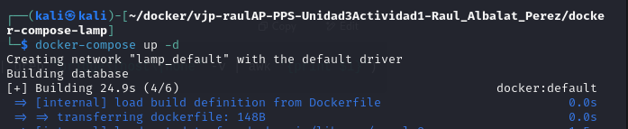
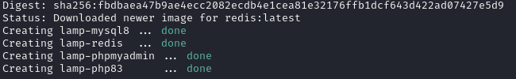

### Creación de base de datos

Para crear la Base de datos que vamos a utilizar para esta actividad voy a realizarla con la opción 1, desde la terminal. Aunque tenemos más opciones

**OPCIÓN 1: Desde terminal**
---

Mi base de datos se encuentra en el contenedor **lamp-mysql18**, por lo que debo conectarme al servidor MySQL ejecutándose en dicho contenedor. Para ello, accedemos al contenedor con el siguiente comando:

~~~
docker exec -it  lamp-mysql8  /bin/bash
~~~
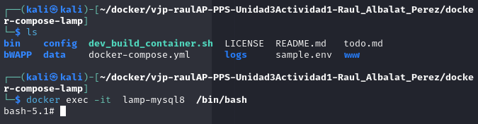

Una vez dentro del contenedor, iniciamos sesión en el servidor MySQL utilizando el usuario **root** y contraseña **tiger**.

~~~
mysql -u root -p
~~~
adjunto captura de proceso.

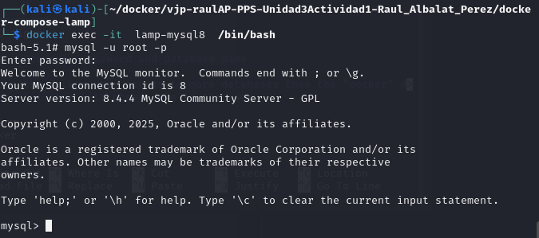

 Una vez conectados al servidor MySQL, ejecutamos las siguientes consultas SQL para crear la base de datos, la tabla **usuarios** y añadir algunos registros de ejemplo:

~~~
CREATE DATABASE SQLi;
USE SQLi;
CREATE TABLE usuarios (
	id INT AUTO_INCREMENT PRIMARY KEY,
	usuario VARCHAR(50) NOT NULL,
	contrasenya VARCHAR(100) NOT NULL
);
INSERT INTO usuarios (usuario, contrasenya) VALUES ('admin', '1234'), ('usuario', 'password');
~~~

Vemos como se ha creado correctamente, tanto Base de Datos, como tabla y usuarios:

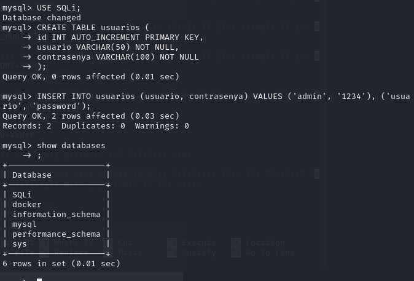
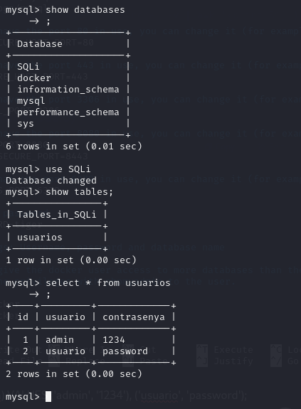

Una vez completada la base de datos. el siguiente paso será crear la página web.
 
### Crear página web en Apache

Voy a crear una aplicación web sencilla que me permita explotar la vulnerabilidad de Inyección SQL (SQLi). Esta aplicación estará alojada en el servidor Apache que forma parte de mi entorno LAMP.

Como recordatorio, en el archivo docker-compose.yml he configurado un volumen bind-mount que vincula la carpeta www de mi sistema anfitrión con la ruta /var/www/html del contenedor donde se ejecuta Apache. Gracias a esto, puedo gestionar fácilmente los archivos de la web desde mi equipo local.

Por tanto, para desplegar la aplicación vulnerable, simplemente coloco los archivos dentro de la carpeta www/, y estos estarán disponibles automáticamente en el servidor web del contenedor.

- Me situo en la carpeta _./www_ y creo una carpeta con nombre SQLi  para esta actividad.

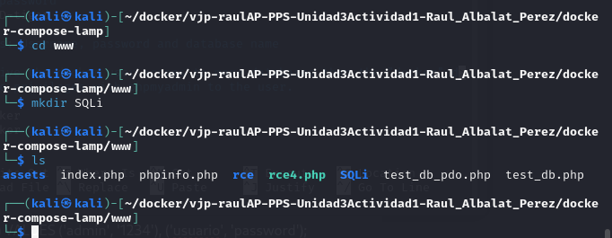

- Creo dentro de esa carpeta un archivo PHP con nombre **login1.php**, con el siguiente contenido:

¡¡¡OJO¡¡¡ que en la 2ª linea hay que cambiar PasswordBBDD por la contraseña de root de tu BBDD (recuerda que la tienes en la configuración de variables de entorno, el archivo .env).

~~~
<?php
$conn = new mysqli("database", "root", "tiger", "SQLi");
        if ($_SERVER["REQUEST_METHOD"] == "POST") {
                $username = $_POST["username"];
                $password = $_POST["password"];
                $query = "SELECT * FROM usuarios WHERE usuario = '$username' AND contrasenya = '$password'";
                echo "Consulta ejecutada: " . $query . " ";
                $result = $conn->query($query);
                if ($result) {
                        if ($result->num_rows > 0) {
                                echo "Inicio de sesión exitoso ";
                                // Modificación: Mostrar datos extraídos de la consulta
                                while ($row = $result->fetch_assoc()) {
                                        echo "ID: " . $row['id'] . " - Usuario: " . $row['usuario'] . " -Contraseña: " . $row['contrasenya'] . " ";
                                }
                } else {
                        echo "Usuario o contraseña incorrectos";
                }
        } else {
                echo "Error en la consulta: " . $conn->error;
        }
}
?>
<form method="post">
        <input type="text" name="username" placeholder="Usuario">
        <input type="password" name="password" placeholder="Contraseña">
        <button type="submit">Iniciar Sesión</button>
</form>

~~~
Esta página nos muestra dos campos para que introduzcamos nuestro usuario y nuestra contraseña.

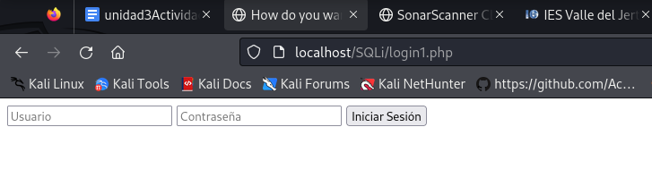

Podemos ver los datos de nuestros usuarios desde PHPMyAdmin en la siguientes dirección: <http://localhost:8080/index.php?route=/sql&pos=0&db=SQLi&table=usuarios>

Como podemos ver en la imagen, el usuario **admin** tiene contraseña **admin123**.

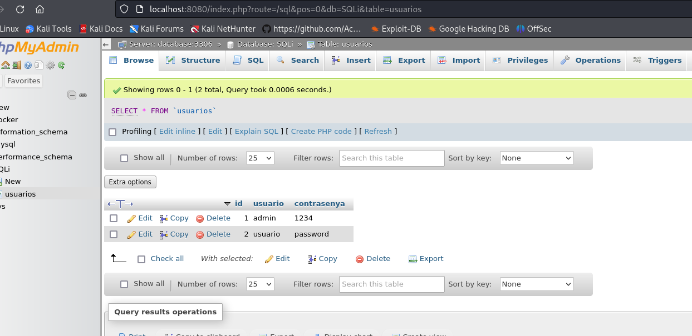

Con los datos que he introducido en los campos del formulario, realizo una consulta a la base de datos para comprobar si el usuario y la contraseña que he ingresado son correctos.

Ya tendré preparado mi servidor web para poder observar las vulnerabilidades de Inyección SQL. Para ello, accedo a la aplicación desde `http://localhost/SQLi/login1.php`

Si introducimos el usuario **admin** y la contraseña **123** la consulta dice que es usuario y contraseña correcta y nos dejaría logearnos en la página.

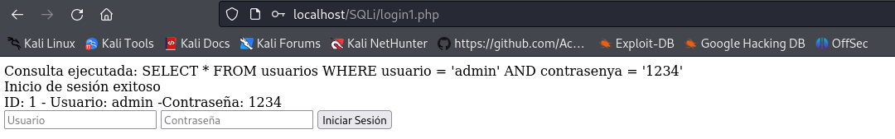

Como vemos, el problema se produce debido a que hacemos la consulta que hacemos a la base de datos es la siguiente:

`$query = "SELECT * FROM usuarios WHERE usuario = '$username' AND contrasenya = '$password'"`

Estamos construyendo la consulta directamenbte con lo escrito en los campos de usuario y contraseña. Podemos cambiar el sentido de la consulta si utilizamos las comillas simples "'".

## Explotación de Inyección SQL

Podemos inyectar infinidad de código. Entre ello, podemos hacer ataques de:

**Bypass de autenticación**

Para realizar la explotación, en el campo "Usuario" ingresar: 

~~~
' OR '1'='1' -- -
~~~

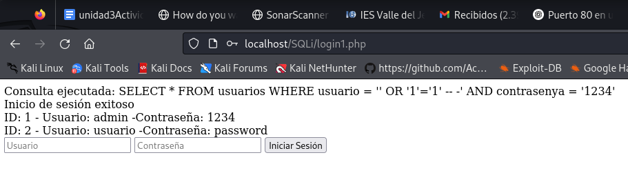

> Resultado esperado: Podré iniciar sesión sin necesidad de proporcionar credenciales válidas.

**Obtener credenciales de la base de datos**

Para llevar a cabo la explotación, ingresaré lo siguiente en el campo "Usuario":

~~~
' UNION SELECT NULL, usuario, contrasenya FROM usuarios #
~~~

> Resultado esperado: Se muestran todos los usuarios y contraseñas.

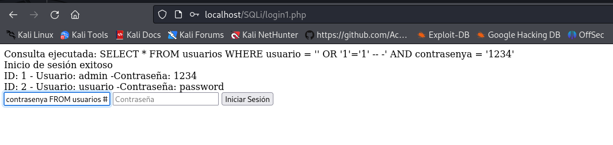
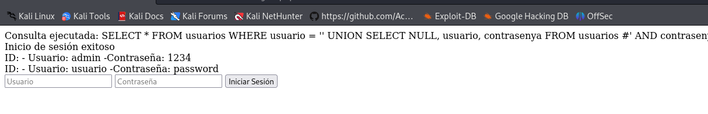

**Problemas del primer código (Inseguro)**
---

1. **Vulnerabilidad a inyección SQL**

	- La consulta SQL inserta directamente los valores del usuario ('$username' AND password = '$password').

	- No se usan consultas preparadas.

2. **Contraseñas almacenadas en texto plano**

	- La base de datos parece almacenar las contraseñas en texto sin cifrar.

	- Esto es una mala práctica, ya que si la base de datos es comprometida, todas las contraseñas quedan expuestas.

3. **Falta de validación y sanitización de entrada**

	- No hay ningún tipo de limpieza en los valores obtenidos de $_POST, lo que facilita ataques como XSS o inyecciones maliciosas.

4. **No se maneja la conexión a la base de datos adecuadamente**

	- No se verifica si la conexión es exitosa.

	- No se cierra la conexión después de ejecutar la consulta.

## Mitigación de vulnerabiliad

Para ir añadiendo soluciones sin eliminar las versiones previas, generaré un nuevo archivo a partir del anterior, en el que realizaré modificaciones para ir perfeccionando la solución.
 
~~~
cp login1.php login2.php 
~~~

### Primera mitigación, escapar los caracteres especiales.

Nuestro login2.php debe de tener el siguiente contenido

~~~
<?php
$conn = new mysqli("database", "root", "password", "SQLi");
        if ($_SERVER["REQUEST_METHOD"] == "POST") {
                $username = $_POST["username"];
                $password = $_POST["password"];
                $username = addslashes($username);
                $password = addslashes($password);
                $query= "SELECT * FROM usuarios WHERE usuario = '$username' AND contrasenya = '$password'";
                echo "Consulta ejecutada: " . $query . " ";
                $result = $conn->query($query);
                if ($result) {
                        if ($result->num_rows > 0) {
                                echo "Inicio de sesión exitoso ";
                                // Modificación: Mostrar datos extraídos de la consulta
                                while ($row = $result->fetch_assoc()) {
                                        echo "ID: " . $row['id'] . " - Usuario: " . $row['usuario'] . " -Contraseña: " . $row['contrasenya'] . " ";
                                }
                } else {
                        echo "Usuario o contraseña incorrectos";
                }
        } else {
                echo "Error en la consulta: " . $conn->error;
        }
}
?>
<form method="post">
        <input type="text" name="username" placeholder="Usuario">
        <input type="password" name="password" placeholder="Contraseña">
        <button type="submit">Iniciar Sesión</button>
</form>

~~~

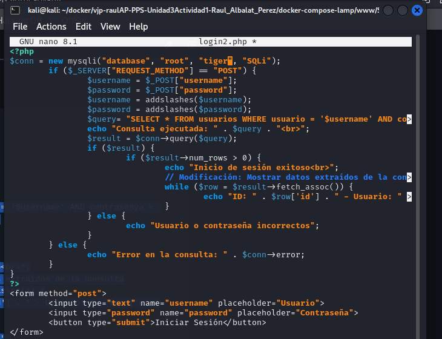

Como podemos observar, es posible incluir consultas dentro de los campos al utilizar caracteres especiales como las comillas.

Por lo tanto, la primera aproximación será escapar estos caracteres especiales en los valores de la consulta.

La función **addslashes()** nos permite lograrlo, ya que devuelve una cadena con barras invertidas delante de los caracteres que deben ser escapados en situaciones como consultas a bases de datos. Los caracteres que se escapan son la comilla simple **(')**, la comilla doble **(")**, la barra invertida **(/)** y el byte NUL **(NULL)**.

Así que procederé a modificar el archivo anterior, añadiendo las líneas necesarias para escapar los caracteres especiales tanto en el campo de usuario como en el de la contraseña y el resultado es que ya no funciona la inyección SQL:

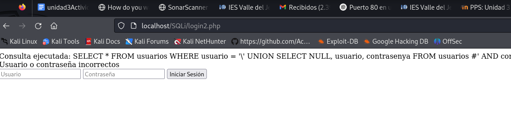

**Mejoras en el segundo código (Más seguro, pero aún con problemas)**

1. Uso de consultas preparadas.

	- Se usa $stmt->prepare() y bind_param(), lo que previene inyección SQL.

	- Ventaja: No importa qué ingrese el usuario, la consulta tratará los valores como datos, no como código ejecutable.

2. Se valida la conexión a la base de datos.

	- Se verifica si connect_error devuelve un error antes de continuar.

	- Si hay un fallo, el script termina con die(), lo que evita que se ejecuten consultas en una conexión fallida.

3. Se escapan los caracteres especiales con la función **addslashes()**.

4. Manejo de la conexión a la base de datos.

	- Se cierra la consulta (**$stmt->close()**) y la conexión (**$conn->close()**) correctamente.

**Problemas que aún tiene el segundo código** 

1. Las contraseñas siguen almacenándose en texto plano.

	- Aunque se evita la inyección SQL, el código sigue comparando contraseñas directamente en la base de datos.

	- Solución correcta: Almacenar las contraseñas con **password\_hash()** y verificar con **password\_verify()**.

2. Mensajes de error genéricos

	- Se sigue mostrando información detallada sobre los usuarios si la consulta es exitosa.

	- Lo correcto sería iniciar una sesión en lugar de mostrar información del usuario.

3. No hay control de sesiones

	- A pesar de corregir varios problemas de seguridad, no se establece una sesión segura (session_start()) después de una autenticación exitosa.

## Código mejorado uso consultas parametrizadas

Voy a incorporar esas mejoras. Para ello me creo un **login3.php**  que contenga las mejoras. 

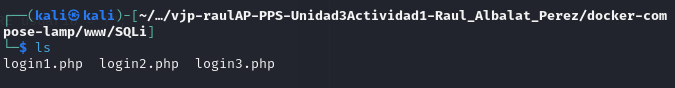

~~~
<?php
$conn = new mysqli("database", "root", "password", "SQLi");

// Verificar conexión
if ($conn->connect_error) {
    die("Error de conexión: " . $conn->connect_error);
}

if ($_SERVER["REQUEST_METHOD"] == "POST") {
    $username = $_POST["username"] ?? '';
    $password = $_POST["password"] ?? '';

    // Verificar si los campos están vacíos
    if (empty($username) || empty($password)) {
        die("Error: Usuario y contraseña son obligatorios.");
    }

    // Consulta segura con prepared statements
    $query = "SELECT id, usuario, contrasenya FROM usuarios WHERE usuario = ?";
    $stmt = $conn->prepare($query);
    
    if (!$stmt) {
        die("Error en la preparación de la consulta: " . $conn->error);
    }

    $stmt->bind_param("s", $username);
    $stmt->execute();
    $result = $stmt->get_result();

    if ($result && $result->num_rows > 0) {
        $row = $result->fetch_assoc();
        
        // Verificar contraseña hasheada (suponiendo uso de password_hash())
        if (password_verify($password, $row["contrasenya"])) {
            echo "Inicio de sesión exitoso ";
            echo "ID: " . htmlspecialchars($row['id']) . " - Usuario: " . htmlspecialchars($row['usuario']) . " ";
        } else {
            echo "Usuario o contraseña incorrectos";
        }
    } else {
        echo "Usuario o contraseña incorrectos";
    }

    $stmt->close();
}

$conn->close();
?>

<form method="post">
    <input type="text" name="username" placeholder="Usuario">
    <input type="password" name="password" placeholder="Contraseña">
    <button type="submit">Iniciar Sesión</button>
</form>
~~~
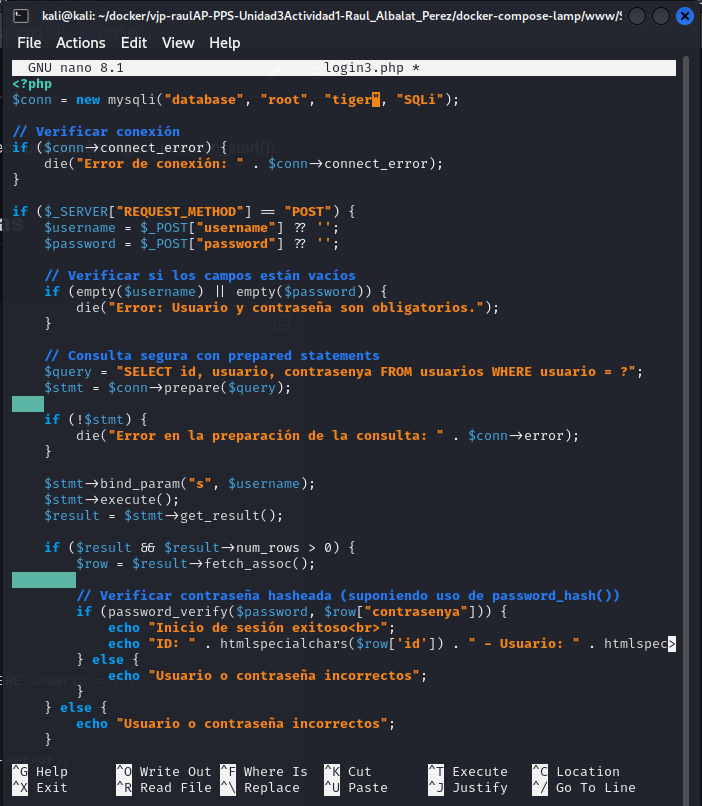

adjunto captura del resultado con éxito

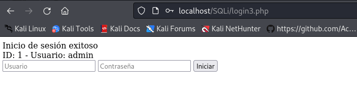

**Explicación de las mejoras**
---
✅ Consultas preparadas: **prepare()** y **bind_param()** protegen contra SQL Injection.

✅ Eliminación de addslashes(): No es necesario con consultas preparadas.

✅ Escapado de salida con **htmlspecialchars()**: Evita XSS en los datos mostrados.

✅ Uso de **password_hash()** y **password_verify()**: Si las contraseñas en la base de datos no están hasheadas, hay que actualizarlas con password_hash().

 Guardar las contraseñas en BBDD con la función **password_hash()**:

Si las contraseñas aún no están almacenadas con **password_hash()**, a la hora de guardar las contraseñas en la BBDD, en PHP necesitarás guardarlas con algo como:

~~~
$hashed_password = password_hash("tu_contraseña", PASSWORD_DEFAULT);
~~~

A la hora de leerla usaríamos la función:  **password_verify()**	

## ENTREGA
---
>__Realiza las operaciones indicadas__

>__Crea un repositorio  con nombre PPS-Unidad3Actividad4-Tu-Nombre donde documentes la realización de ellos.__

> No te olvides de documentarlo convenientemente con explicaciones, capturas de pantalla, etc.

>__Sube a la plataforma, tanto el repositorio comprimido como la dirección https a tu repositorio de Github.__